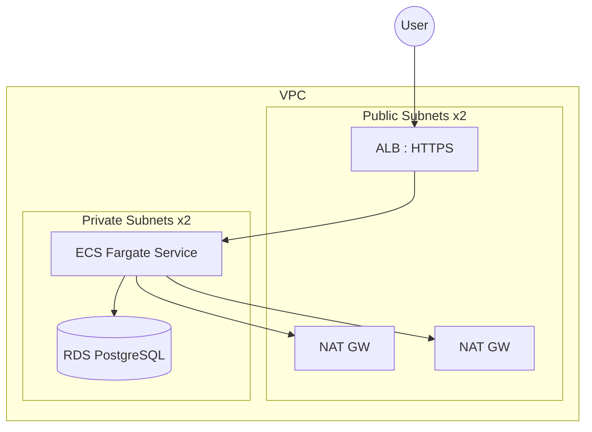

# Architecture

This platform provisions a two-AZ VPC with public and private subnets. The ALB sits in public subnets, while ECS Fargate and RDS run in private subnets. NAT gateways provide outbound access for tasks and patching.

Production uses one NAT gateway per AZ; dev defaults to a single NAT for cost.

## Key Flows

- Inbound traffic terminates TLS at the ALB.
- ALB forwards requests to ECS tasks in private subnets.
- ECS tasks access RDS within the VPC.
- Secrets are retrieved from AWS Secrets Manager by the ECS execution role.
