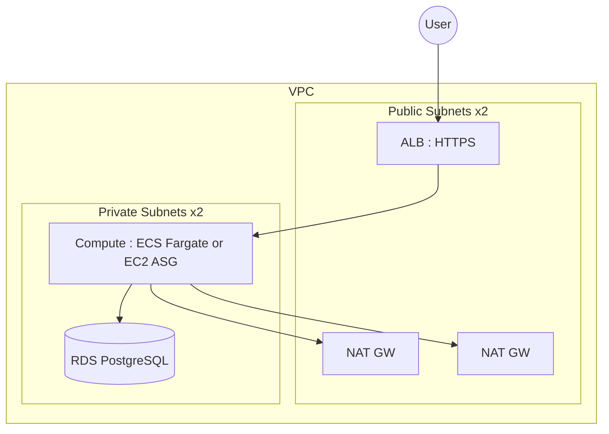

# Architecture

If I were sketching this on a whiteboard, I would start at the edge and walk inward:

1) The user hits the ALB in the public subnets. TLS terminates here. HTTP only exists when `allow_http = true` in dev.
2) The ALB forwards to the compute layer in private subnets. ECS Fargate runs when `compute_mode = "ecs"`; EC2 Auto Scaling runs when `compute_mode = "ec2"`.
3) Compute talks to RDS in private subnets. The DB security group only allows traffic from the compute security group.
4) For outbound internet access (image pulls, patches, external APIs), compute traffic goes through NAT gateways. Dev uses a single NAT; prod uses one per AZ.

RDS manages the master password and stores it in Secrets Manager. ECS tasks retrieve it via the execution role; EC2 instances can retrieve it via the instance role.

## Notes

- The ALB is the only public entry point.
- Compute and RDS are private by default; only the ALB and NAT gateways are exposed to the internet.
- Outbound traffic from the compute layer is the main reason NAT gateways exist here.
