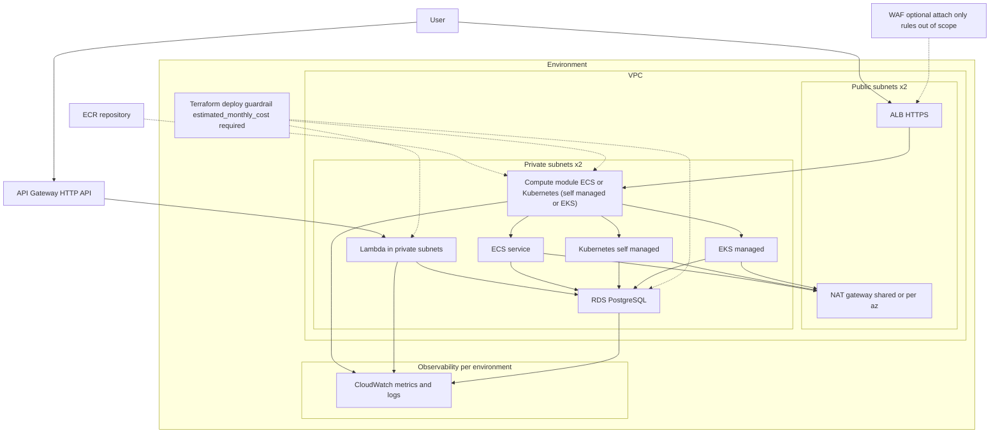

# Architecture

If I were sketching this on a whiteboard, I would start at the edge and walk inward:

1) The user hits the ALB in the public subnets. TLS terminates here. HTTP only exists when `allow_http = true` in dev. A WAF can be attached, but rule sets are out of scope for this repo.
2) Optional: the user can hit an API Gateway HTTP API, which invokes a Lambda function in private subnets. When enabled, that Lambda can optionally reach RDS through an explicit security group rule.
3) The ALB forwards to the compute layer in private subnets. Compute runs either as ECS tasks with capacity providers (Fargate, Fargate Spot, or EC2 capacity provider) or as Kubernetes (self-managed on EC2 or EKS). For Kubernetes, the ALB forwards to a NodePort on worker nodes backed by an ingress controller.
4) Container images live in an environment-scoped ECR repository. ECS tasks pull from ECR using the task execution role; Kubernetes nodes use the ECR credential helper configured during node bootstrap.
5) Compute and Lambda talk to RDS in private subnets. The DB security group only allows traffic from the compute and Lambda security groups.
6) For outbound internet access (image pulls, patches, external APIs), compute traffic goes through NAT gateways. `single_nat_gateway` controls whether there is one NAT (dev default) or one per AZ (prod default). VPC endpoints keep S3/DynamoDB (gateway) and optional ECR/Logs/SSM (interface) traffic off the NAT.
7) CloudWatch is scoped per environment for metrics and logs. ECS, Kubernetes nodes, Lambda, and RDS publish there; we do not duplicate it elsewhere.
8) Terraform deployments require an `estimated_monthly_cost` guardrail per environment before applying changes.

RDS manages the master password and stores it in Secrets Manager. ECS tasks inject it as `DB_SECRET` by default; Kubernetes secrets are not wired in this repo.

For `k8s_self_managed`, kubeadm boots a single control plane instance. The join command is stored in SSM Parameter Store (encrypted with a CMK) so worker nodes can join without public SSH.

The canonical Mermaid source is `docs/architecture.mmd`; regenerate the SVG with `make diagram`, which runs `npx -y @mermaid-js/mermaid-cli@10.9.1`.

## Notes

- The ALB is the default public entry point for ECS/Kubernetes traffic.
- The serverless API (if enabled) is a parallel ingress path; it does not replace the ALB.
- Compute and RDS are private by default; only the ALB and NAT gateways are exposed to the internet.
- Outbound traffic from the compute layer is the main reason NAT gateways exist here.
- Lambda in private subnets still needs NAT or VPC endpoints to call AWS APIs.
